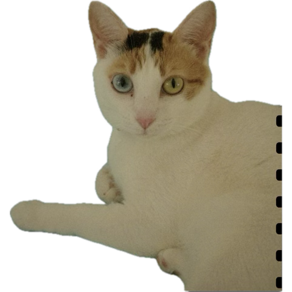

  

<h2 style="text-align:center;margin:.5rem 0 .25rem 0;font-weight:700;">
  Hey there! 👋 Wishing you a great day!
</h2>

  Welcome to my personal <strong>tech vault</strong> — a living hub where I keep the tools, snippets, docs, and notes I use to build, troubleshoot, and explore.
  It grows as I discover new technologies, refine workflows, and push my skills. From programming and security to systems and creative work,
  this space stays <em>fast, organized, and useful</em>.

