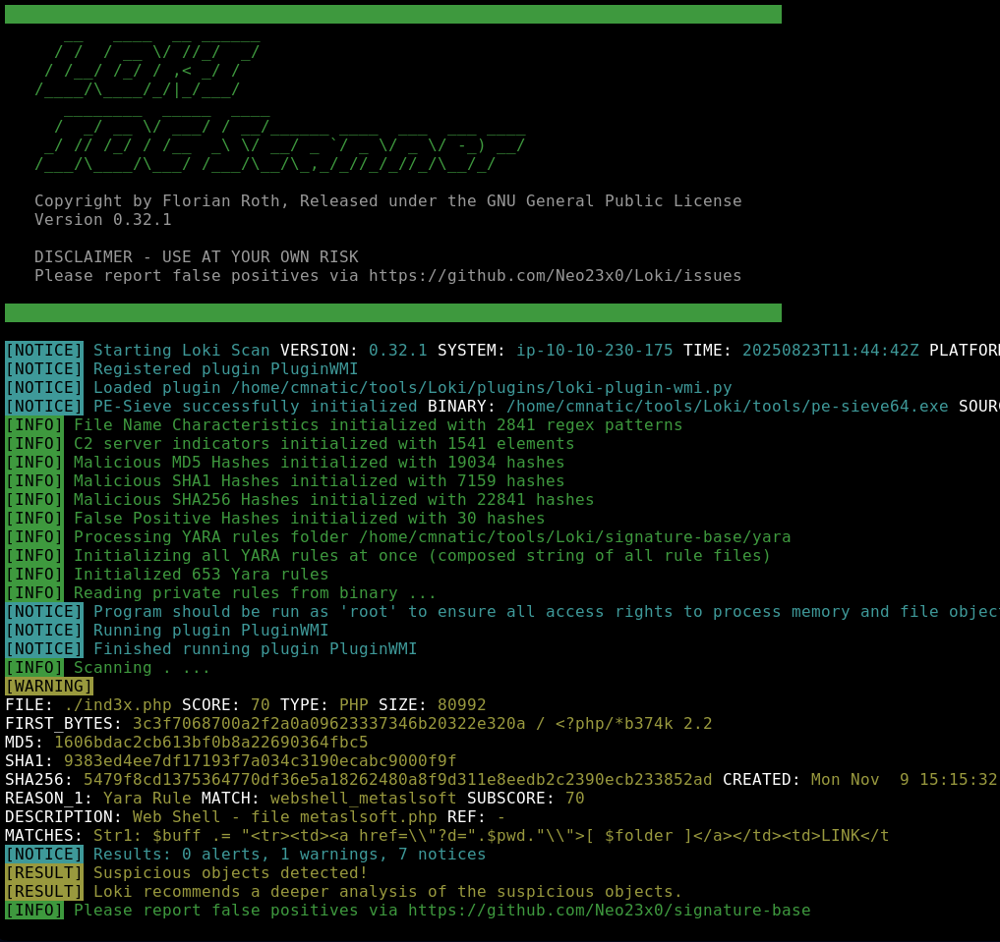
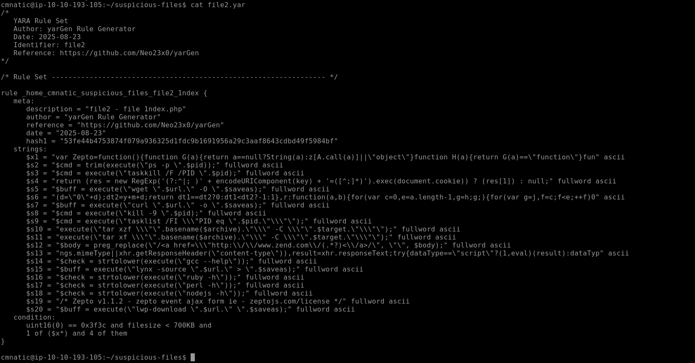
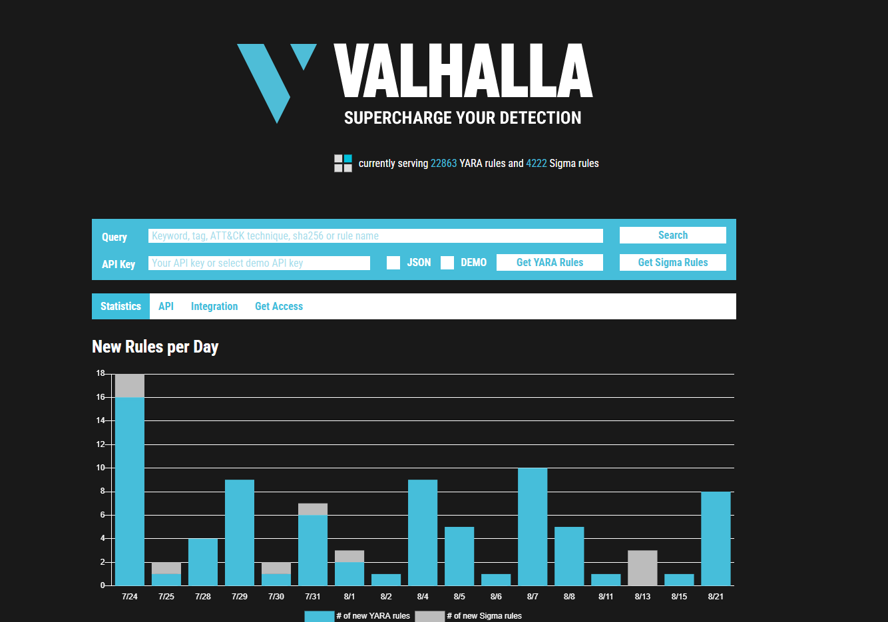

# Yara Rules


*YARA – The Pattern Matching Swiss Knife*

Have you heard(?):

- _“The pattern matching swiss knife for malware researchers (and everyone else).”_ — VirusTotal (2020)"

---

*BTW I used TryHackMe as my guide for YARA rules, so I’m sharing the specific room here: [TryHackMe - Yara](https://tryhackme.com/room/yara). However, I also did my own research, as you should too.*

---
# What is YARA & What Does It Detect?
- Yara  is a tool used for detecting and classifying files based on patterns
- Supports both binary and text-based patterns such as:
	 - Hexadecimal sequences
	 - Strings (ASCII/Unicode)
	 - Regex expressions
- Uses rules you define against **files**, **directories**, or **process IDs**

---
# Why Strings Matters

- Strings are simple sequences of characters used to store text in applications
- Example

	 ```python
	 print("Hello World!)
	 ```
 The text "Hello World!" is stored as a string.

 - Malware works the same way it stores information as strings, such as:
	-  Ransomware
		``12t9YDPgwueZ9NyMgw519p7AA8isjr6SMw``
		*Bitcoin wallet for ransom payments*
	-  Botnet:
		``12.34.56.8``
		*IP address of the Command & Control (C2) Server*

---

# Basic Requirements

- **Every YARA command needs:**
	1. The rule file you create
	2. The target(file, directory or PID)

- Every Rule must have
	- A name
	- A condition

---
# Example: First Rule

1. Create a file:
```python
touch somefile
```
2. Create a rule file:
```python
touch myfirstrule.yar  
```
2. Edit ``myfirstrule.yar`` and add:
```python 
rule examplerule {
	condition: true
}
```
- This rule checks if the target exists because the condition is always true.


---
# Run the Rule

```python
yara myfirstrule.yar somefile
```

- If somefile exists:
	Output -> ``example rule somefile``

- If it does not exist:
	Output -> ``error scanning sometextfile: could not open file``

---

# What Are YARA Modules?
YARA modules are **built-in extensions** that provide extra features for your rules.  
They allow you to inspect:
- File structure & metadata
- Calculate entropy
- Compute hashes
- Analyze imports and sections (for PE, ELF, etc.)

Think of them as **power-ups for your rules**.

---

# Why Use Modules?
- To detect **specific file types** (PE, ELF, Mach-O)
- To verify **imports, sections, or architecture**
- To check for **packed or encrypted content**
- To match **hash-based IOCs**

---

# Common Modules & Examples

# 1. PE Module
Analyze Windows Portable Executable files.
```python
import "pe"

rule detect_pe_import {
    condition:
        pe.imports("kernel32.dll", "VirtualAlloc")
}
```

# 2. ELF Module

Analyze Linux ELF binaries.
```python
import "elf"

rule detect_elf_x86 {
    condition:
        elf.machine == elf.MACHINE_X86
}
```


# 3. Math Module
Calculate entropy to detect packing/encryption.
```python
import "math"

rule high_entropy {
    condition:
        math.entropy(0, filesize) > 7.5
}

```

# 4. Hash Module
Check for known file hashes.```
```python
import "hash"

rule check_md5 {
    condition:
        hash.md5(0, filesize) == "44d88612fea8a8f36de82e1278abb02f"
}

```


# When Do You Need Them?

 Use modules when:
- You need **metadata, structure, or calculated values**.

 Not needed when:
- You only match **simple strings or hex patterns**.


# Smart Move
Combine strings and module checks for strong detection:
```python
import "pe"

rule combined_check {
    strings:
        $a = "Mimikatz"
    condition:
        $a and pe.imports("advapi32.dll", "CryptAcquireContextA")
}
```


---

# Automating YARA Rule Development

Developing YARA rules from scratch can be fun for simple cases, but it often becomes **time-consuming** for complex patterns.  
That’s why **automation tools** exist to make the process easier.  
Some great developers (like Florian Roth) have created tools that help us **build and manage YARA rules with automation**.

In this section, we’ll look at **LOKI**, but here’s a quick reference table of popular tools:

---

# YARA Automation Tools

| Tool          | Description                                                                                                                              | Link                                                         |
| ------------- | ---------------------------------------------------------------------------------------------------------------------------------------- | ------------------------------------------------------------ |
| **LOKI**      | Free open-source **IOC scanner** by Florian Roth. Detects based on filenames, YARA rules, hashes, and C2 checks. Works on Windows/Linux. | [LOKI GitHub](https://github.com/Neo23x0/Loki)               |
| **THOR Lite** | Advanced multi-platform **IOC + YARA scanner** (Windows/Linux/macOS). Offers scan throttling to reduce CPU usage. Free version of THOR.  | [THOR Lite Info](https://www.nextron-systems.com/thor-lite/) |
| **FENRIR**    | Bash-based IOC checker by Florian Roth. Works on any system running Bash (Linux, macOS, even Windows WSL).                               | [FENRIR GitHub](https://github.com/Neo23x0/Fenrir)           |
| **YAYA**      | "Yet Another Yara Automaton" by the EFF. Helps manage multiple YARA rule repositories, add custom rules, and scan files. Linux-only.     | [YAYA GitHub](https://github.com/EFForg/yaya)                |

---

# Why Use These Tools?
- **Faster rule creation**
- **Automated IOC checks**
- **Built-in scanning logic**
- **Cross-platform support**

---

# LOKI – Quick Overview
- LOKI detects threats using 4 main methods:
  1. **File Name IOC Check**
  2. **YARA Rule Check**
  3. **Hash Check**
  4. **C2 Back Connect Check**
- Supports **Windows** and **Linux**
- GitHub: [https://github.com/Neo23x0/Loki](https://github.com/Neo23x0/Loki)

### Example: Displaying Help
```bash
python3 loki.py -h
```

# THOR Lite – Quick Overview
- Multi-platform scanner for **IOC + YARA**
- Supports **Windows, Linux, macOS**
- Includes **scan throttling**
- Free version available: **THOR Lite**
- More info: [THOR Lite](https://www.nextron-systems.com/thor-lite/)

---

# FENRIR – Quick Overview
- **Bash-based IOC checker**
- Lightweight and portable
- Works on any OS that supports **Bash**
- GitHub: [FENRIR](https://github.com/Neo23x0/Fenrir)

---

# YAYA – Quick Overview
- Manages multiple **YARA rule repositories**
- Allows **importing, adding, and disabling rule sets**
- **Linux-only**
- GitHub: [YAYA](https://github.com/EFForg/yaya)


---

# Using LOKI

In cybersecurity operations, staying ahead of attackers often means digging into **threat intelligence reports**, security blogs, and research papers to learn about new tactics, techniques, and procedures. These resources usually include **Indicators of Compromise (IOCs)**—like file hashes, IP addresses, and domain names, alongside **YARA rules** that help identify suspicious activity.

Sometimes, though, you might come across an artifact or file that none of your existing security tools detect. This is where tools like **LOKI** become extremely useful. It allows you to:
- Incorporate your own YARA rules based on threat intel
- Leverage findings from **incident response or forensic investigations**

The best part? **LOKI already ships with a robust collection of YARA rules**, so you can start scanning endpoints for malicious indicators right away.

command to run LOKI : 

```python
python ../../tools/Loki/loki.py -p .
```

(Showcasing you my LOKI Expierence with in the tryhackme walkthrough )

```
cmnatic@ip-10-10-230-175:~/tools/Loki$ python loki.py -h
usage: loki.py [-h] [-p path] [-s kilobyte] [-l log-file] [-r remote-loghost]
               [-t remote-syslog-port] [-a alert-level] [-w warning-level]
               [-n notice-level] [--printall] [--allreasons] [--noprocscan]
               [--nofilescan] [--nolevcheck] [--scriptanalysis] [--rootkit]
               [--noindicator] [--reginfs] [--dontwait] [--intense] [--csv]
               [--onlyrelevant] [--nolog] [--update] [--debug]
               [--maxworkingset MAXWORKINGSET] [--syslogtcp]
               [--logfolder log-folder] [--nopesieve] [--pesieveshellc]
               [--nolisten] [--excludeprocess EXCLUDEPROCESS]

Loki - Simple IOC Scanner

optional arguments:
  -h, --help            show this help message and exit
  -p path               Path to scan
  -s kilobyte           Maximum file size to check in KB (default 5000 KB)
  -l log-file           Log file
  -r remote-loghost     Remote syslog system
  -t remote-syslog-port
                        Remote syslog port
  -a alert-level        Alert score
  -w warning-level      Warning score
  -n notice-level       Notice score
  --printall            Print all files that are scanned
  --allreasons          Print all reasons that caused the score
  --noprocscan          Skip the process scan
  --nofilescan          Skip the file scan
  --nolevcheck          Skip the Levenshtein distance check
  --scriptanalysis      Activate script analysis (beta)
  --rootkit             Skip the rootkit check
  --noindicator         Do not show a progress indicator
  --reginfs             Do check for Regin virtual file system
  --dontwait            Do not wait on exit
  --intense             Intense scan mode (also scan unknown file types and
                        all extensions)
  --csv                 Write CSV log format to STDOUT (machine processing)
  --onlyrelevant        Only print warnings or alerts
  --nolog               Don't write a local log file
  --update              Update the signatures from the "signature-base" sub
                        repository
  --debug               Debug output
  --maxworkingset MAXWORKINGSET
                        Maximum working set size of processes to scan (in MB,
                        default 100 MB)
  --syslogtcp           Use TCP instead of UDP for syslog logging
  --logfolder log-folder
                        Folder to use for logging when log file is not
                        specified
  --nopesieve           Do not perform pe-sieve scans
  --pesieveshellc       Perform pe-sieve shellcode scan
  --nolisten            Dot not show listening connections
  --excludeprocess EXCLUDEPROCESS
                        Specify an executable name to exclude from scans, can
                        be used multiple times
cmnatic@ip-10-10-230-175:~/tools/Loki$ 
```

First command you should run after installing LOKI is **--update** this is important  because it will add a signature-base directory, which Loki uses to scan for known evil. 



*There is 3 results that the LOKI can output that is malicious/suspicious or clean file*

---

## Creating YARA Rules with yarGen

**yarGen** is a tool designed to automatically generate YARA rules based on strings extracted from malware samples. Its core principle is to identify unique strings in malicious files while filtering out those commonly found in legitimate software, reducing the risk of false positives.

The tool includes extensive databases of goodware strings and opcodes, which are used to exclude non-malicious patterns during rule creation. When executed, yarGen analyzes the specified sample files, extracts candidate strings, removes common or goodware-associated strings, and outputs a YARA rule that can be used for threat detection.

This approach is particularly useful during incident response when analysts need to quickly create reliable detection signatures for newly discovered malware. The generated YARA rules can then be applied across systems to identify additional infections and prevent further compromise.



---

## Valhalla – Online YARA Feed

**Valhalla** [Link here](https://valhalla.nextron-systems.com) is an online YARA feed created and hosted by Nextron-Systems. It provides a large collection of high-quality, hand-crafted YARA rules aimed at improving detection capabilities. These rules are curated and maintained by experienced security professionals, ensuring accuracy and reducing false positives.

Valhalla allows users to perform searches based on various parameters, including:
- **Keyword**: Search for rules related to a specific term.
- **Tag**: Identify rules associated with certain techniques or behaviors.
- **ATT&CK Technique**: Correlate with the MITRE ATT&CK framework.
- **SHA256**: Find rules associated with a specific file hash.
- **Rule Name**: Look up a specific YARA rule by its name.

Each rule entry typically includes:
- **Rule Name**
- **Brief Description**
- **Reference Link** for additional information
- **Creation or Update Date**

Valhalla serves as an essential resource for incident response and threat hunting, allowing analysts to leverage pre-built detection signatures without manually writing complex YARA rules. By using Valhalla, security teams can quickly identify known threats, enhance detection mechanisms, and improve overall threat intelligence.




---


Btw here is the documentation of yara : [Yara Documentation](https://yara.readthedocs.io/en/latest)

**John Hammond** has a great video on YARA! I recommend checking it out. Personally, I find videos more effective than just reading, I learn a lot more from them. But of course, it depends on the person.

<div style="text-align:center;">
  <iframe width="1000" height="563" src="https://www.youtube.com/embed/fu71CljrxsU" title="Classify Malware with YARA" frameborder="0" allow="accelerometer; autoplay; clipboard-write; encrypted-media; gyroscope; picture-in-picture; web-share" referrerpolicy="strict-origin-when-cross-origin" allowfullscreen></iframe>
</div>

---
Video from Gerald Auger is also very good!
<div style="text-align:center;">
  <iframe width="1000" height="563" src="https://www.youtube.com/embed/BM23_H2GGMA" title="What are Yara Rules (and How Cybersecurity Analysts Use Them)" frameborder="0" allow="accelerometer; autoplay; clipboard-write; encrypted-media; gyroscope; picture-in-picture; web-share" referrerpolicy="strict-origin-when-cross-origin" allowfullscreen></iframe>
</div>
