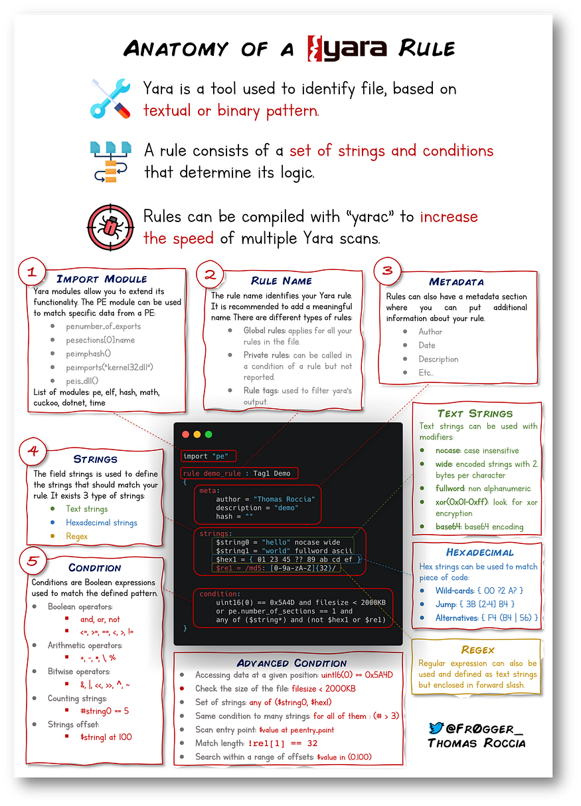

# Yara Rules


*YARA – The Pattern Matching Swiss Knife*

Have you heard(?):

- _“The pattern matching swiss knife for malware researchers (and everyone else).”_ — VirusTotal (2020)"

# What is YARA & What Does It Detect?
- Yara  is a tool used for detecting and classifying files based on patterns
- Supports both binary and text-based patterns such as:
	 - Hexadecimal sequences
	 - Strings (ASCII/Unicode)
	 - Regex expressions
- Uses rules you define against **files**, **directories**, or **process IDs**

---
# Why Strings Matters

- Strings are simple sequences of characters used to store text in applications
- Example
	 ```python
	 print("Hello World!)
	 ```
 The text "Hello World!" is stored as a string.

 - Malware works the same way it stores information as strings, such as:
	-  Ransomware
		``12t9YDPgwueZ9NyMgw519p7AA8isjr6SMw``
		*Bitcoin wallet for ransom payments*
	-  Botnet:
		``12.34.56.8``
		*IP address of the Command & Control (C2) Server*
---

# Basic Requirements

- **Every YARA command needs:**
	1. The rule file you create
	2. The target(file, directory or PID)
		
- Every Rule must have
	- A name
	- A condition
---
# Example: First Rule

1. Create a file:
```python
touch somefile
```
2. Create a rule file:
```python
touch myfirstrule.yar  
```
2. Edit ``myfirstrule.yar`` and add:
```python 
rule examplerule {
	condition: true
}
```
- This rule checks if the target exists because the condition is always true.


---
# Run the Rule

```python
yara myfirstrule.yar somefile
```
- If somefile exists:
	Output -> ``example rule somefile``
- If it does not exist:
	Output -> ``error scanning sometextfile: could not open file``