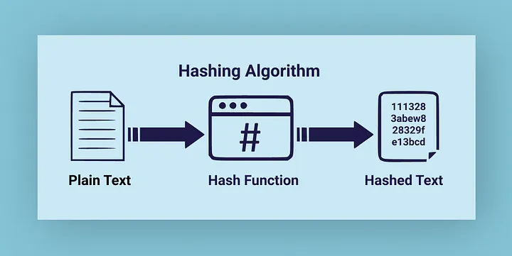
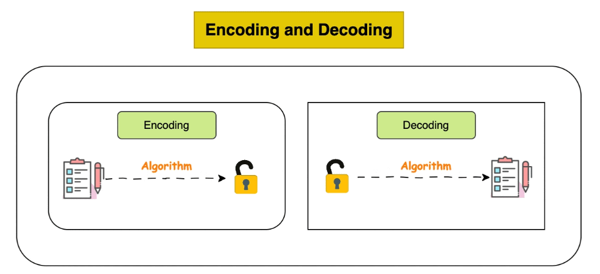
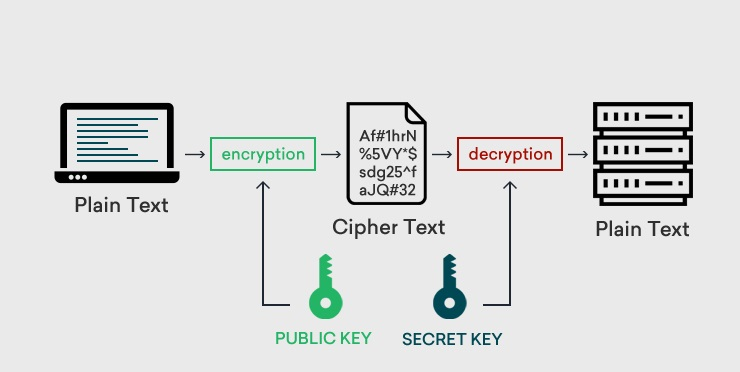

# Differences Hashing/Encoding/Encryption

In information security, it is essential to distinguish between **hashing**, **encoding**, and **encryption**, as all three processes transform data but serve different purposes and possess distinct properties.

---
- **Hashing** is the process of converting data into a fixed-size value (*hash value* or *digest*) that uniquely represents the original data. Even the smallest change in the input will result in a significantly different hash value. This process is <u>**one-way**</u>, meaning it cannot be reversed to recover the original data. Hashing is primarily used for verifying data integrity and authentication.

---
- **Encoding** is the transformation of data from one format to another to ensure **compatibility or enable transfer across different systems**. Examples include **UTF-8**, **UTF-16**, **ASCII**, as well as non-language-specific encodings such as **Base64** and **Base32**. The process is **reversible** and does not provide security, since anyone with the appropriate tools can decode the data.

---
- **Encryption** is the process of transforming data using a cryptographic algorithm (*cipher*) and a **key** to protect confidentiality. The process is <u>**reversible**</u>, but only if the correct key is available and the algorithm used is known. 
 

---

# 📹 Related Video

  <iframe width="1000" height="563" 
      src="https://www.youtube.com/embed/z7FTY7bRy_k" 
      title="YouTube video player" 
      frameborder="0" 
      style="border-radius: 12px; box-shadow: 0 4px 20px rgba(0,0,0,0.3);" 
      allow="accelerometer; autoplay; clipboard-write; encrypted-media; gyroscope; picture-in-picture" 
      allowfullscreen>
  </iframe>

