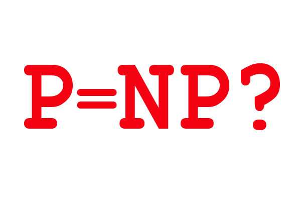

## The P = NP Problem: A Fundamental Question in Computer Science  

The **P = NP** problem is one of the most famous and important unsolved questions in computer science. It is simple to ask but extremely deep in meaning:  

- The class **P** contains problems that can be *solved efficiently* (in polynomial time) by a computer.  
- The class **NP** contains problems that might be very hard to solve, but if someone provides a possible solution, we can *verify it efficiently*.  

The big question is:  
**Does P = NP?**  
In other words, can every problem whose solution can be checked quickly also be solved quickly?  

---

### Why It Matters  

If **P = NP**, then a huge number of problems considered difficult today could be solved efficiently. This would revolutionize many areas such as:  

- **Artificial Intelligence**: Training models, planning, and optimization tasks could be solved much faster.  
- **Logistics & Optimization**: Scheduling, route planning, and resource allocation could all be optimized instantly.  
- **Mathematics & Science**: Proofs, simulations, and models could be solved in ways we cannot currently imagine.  

But the most critical impact would be in **cryptography**. 

---

### P vs NP and Cryptography  

Modern cryptography is built on the assumption that some problems are *computationally hard*. For example:  

- **RSA encryption** relies on the difficulty of factoring large numbers.  
- **Elliptic curve cryptography (ECC)** relies on the hardness of the discrete logarithm problem.  
- **Hash functions** (like SHA-256) are designed so that reversing them (finding an input that produces a given output) should be infeasible.  

These systems are secure only if the underlying mathematical problems cannot be solved efficiently. If **P = NP**, then it would be possible to design algorithms that could *factor large numbers, reverse hashes, or solve discrete logarithms in polynomial time*.  

This means:  

- Password hashes could be cracked almost instantly.  
- Digital signatures could be forged.  
- Secure online communication (HTTPS, banking, cryptocurrencies, blockchain systems) would collapse [1], [2].  

In short, if **P = NP**, most of today’s digital security would no longer exist.  

---

### If P ≠ NP  

If instead **P ≠ NP**, then it is confirmed that there are problems which cannot be solved efficiently. That means cryptography, hashing, and secure communications are built on strong foundations:  

- **Hashes remain one-way functions**, ensuring secure password storage.  
- **Encryption schemes** remain practically unbreakable with current computational power.  
- **Blockchain technology** and other cryptographic protocols can be trusted to remain secure [3].  

This is why the P vs NP problem is not only a theoretical question but also a very practical one, affecting every aspect of digital life.  

---

### The Open Problem  

Despite decades of effort, no one has been able to prove whether P equals NP or not. The problem is so central to mathematics and computer science that the **Clay Mathematics Institute** has named it one of the **Millennium Prize Problems**, offering **1 million dollars** for a correct solution [4].  

Whether the answer is “yes” or “no,” solving this problem will completely change the way we think about computing, security, and even the limits of human knowledge.  

---

### References  

[1] M. Sipser, *Introduction to the Theory of Computation*, 3rd ed., Cengage Learning, 2012.  
[2] J. Katz and Y. Lindell, *Introduction to Modern Cryptography*, 2nd ed., CRC Press, 2014.  
[3] C. H. Papadimitriou, *Computational Complexity*, Addison-Wesley, 1994.  
[4] Clay Mathematics Institute, “The Millennium Prize Problems,” 2000.  
