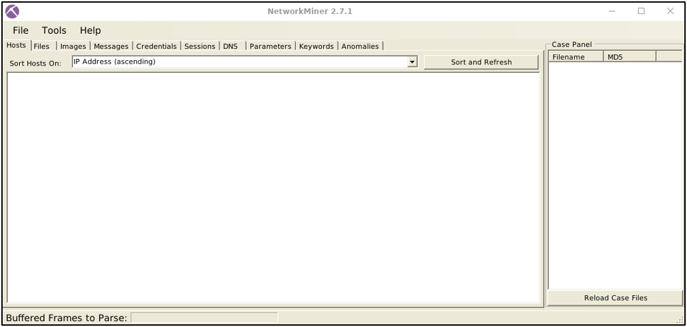

# NetworkMiner is an open-source traffic sniffer, PCAP handler and protocol analyser. Developed and still maintained by Netresec.
# NetworkMiner: fast, passive network forensics without touching the wire

NetworkMiner is a Network Forensic Analysis Tool (NFAT) designed for passive traffic analysis. It runs natively on Windows and also works on Linux, macOS, and FreeBSD. Rather than injecting packets or altering traffic, it listens or parses captures to reconstruct a clear picture of who talked to whom, over which protocols and ports, and what data changed hands. This makes it well suited for incident response scenarios where you want visibility without operational risk.

---

In practice, NetworkMiner excels at quickly mapping observed hosts and sessions. From a single capture it can summarize IP and MAC addressing, infer hostnames and likely operating systems, and highlight candidate services and open ports based on observed flows. Because it understands common protocols and reassembles streams, it can recover transferred files, certificates, and in cases where protection is weak or plaintext is used credentials and parameters. These capabilities make it an efficient triage companion: you open a PCAP and immediately get high-value clues before committing to a packet-by-packet deep dive.

Two data sources matter most: live traffic and saved captures. Live sniffing exists and is primarily useful on Windows, but the tool’s real strength is offline parsing of PCAP/PCAPNG files. In that mode you get a quick, structured overview of an incident, which helps you spot the “low-hanging fruit” and decide where further analysis is warranted. Logs can complement this process, but NetworkMiner’s workflow is centered on passive capture analysis.

---

**There are two operating modes conceptually**: a sniffer mode and an offline parser. The sniffer can be convenient for ad-hoc observation, yet it is not meant to replace dedicated sniffers like Wireshark or tcpdump. The offline parser is the recommended path for investigations: collect traffic via a proper capture method or SPAN/TAP, then point NetworkMiner at the file to harvest hosts, sessions, artifacts, and indicators within minutes.

The tool’s advantages are clear in the early stages of an investigation. It provides immediate situational awareness across hosts, services, and sessions; it performs OS fingerprinting using established fingerprint sets such as p0f/Satori; and it makes artifact extraction straightforward, from images and HTML to certificates and credentials. Its limitations appear when requirements shift to exhaustive filtering, protocol dissector nuance, large-scale PCAP handling, statistical exploration, or payload-level decoding, where Wireshark, Zeek, or specialized pipelines tend to outperform it. Put simply, NetworkMiner is optimized for overview and extraction, not for exhaustive manual dissection of very large captures.

---

**Compared with Wireshark**, the tools share the ability to sniff and read PCAPs, but they diverge in emphasis. NetworkMiner is best treated as a rapid triage and data-extraction engine that organizes evidence by host and session and exposes recovered artifacts with minimal friction. Wireshark is the instrument for deep analysis: powerful display filters, rich protocol decoders, payload and stream inspection, statistics, and advanced troubleshooting. The most effective workflows combine the two: capture traffic, open the file in NetworkMiner to identify suspicious hosts, files, credentials, or tool fingerprints such as Nmap scan patterns, and then pivot to Wireshark for the specific flows that merit close inspection.

---

A practical workflow might look like this. First, capture traffic with a proper tool and source (for example, tcpdump on a monitored interface or a SPAN/TAP feed) to a PCAP file. Next, open the PCAP in NetworkMiner to enumerate hosts, sessions, and likely operating systems, and to recover files and credentials that were transmitted. As findings emerge such as an unexpected client fetching executables over HTTP, a certificate that does not match expected infrastructure, or repeated connection attempts indicative of scanning or brute force—pivot those flows into Wireshark for fine-grained decoding and validation. If captures are very large, split them by time window or interface to keep triage responsive. When operating in a forensic context, record hashes of the original PCAPs and preserve chain of custody so that any recovered artifacts can be defended as evidence.

**There are free and professional editions;** the free edition is sufficient for most triage and teaching scenarios, while the professional edition adds convenience and advanced features for larger or repeated workflows. Regardless of edition, the strategic value remains the same: use NetworkMiner to quickly surface what matters, then bring heavyweight analyzers to bear where depth and precision are required.

a nice video from  Motasem Hamdan and tryhackme explain some things about network miner
> truth is network miner is a bit old/unfamous however understanding NetworkMiner helps you quickly extract hosts, sessions, files, and indicators from network captures, which is essential for rapid triage and incident response in any SOC environment. (my opinion....)

  <iframe width="1000" height="563" src="https://www.youtube.com/embed/U9oG9IlvywA" title="Network Forensics with Network Miner | TryHackMe SOC Level 1" frameborder="0" allow="accelerometer; autoplay; clipboard-write; encrypted-media; gyroscope; picture-in-picture; web-share" referrerpolicy="strict-origin-when-cross-origin" allowfullscreen></iframe>

