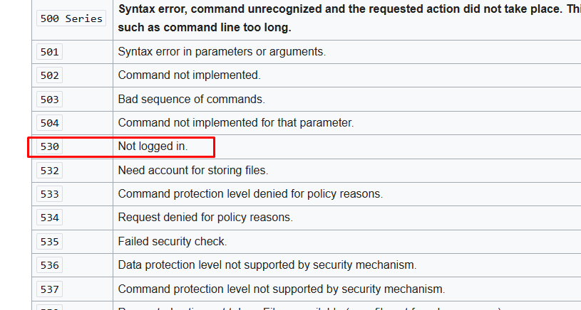
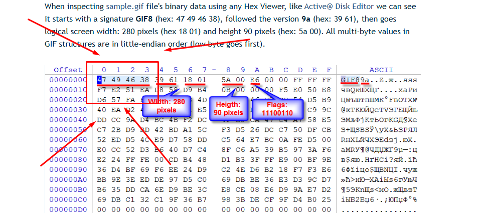
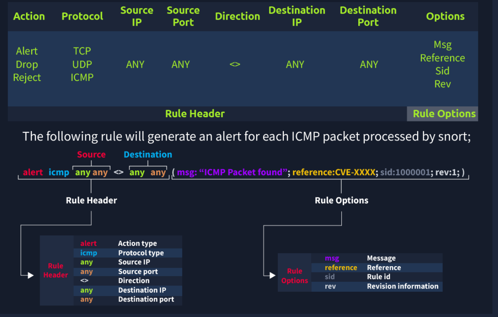
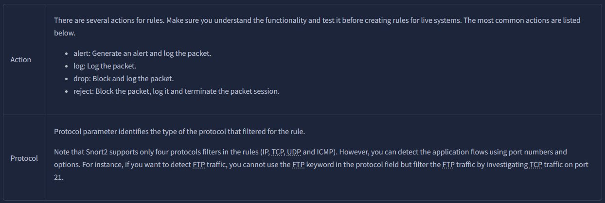
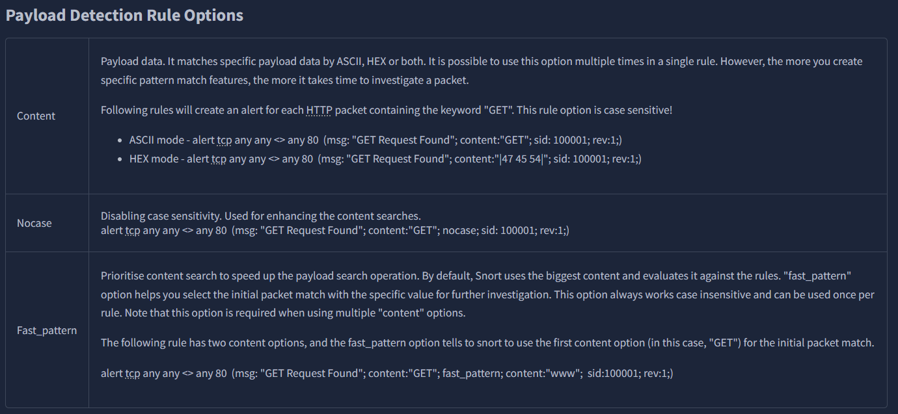
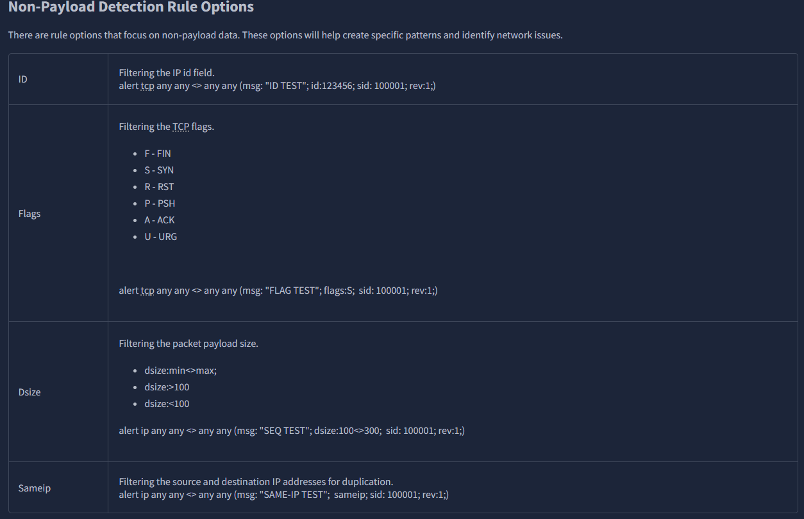
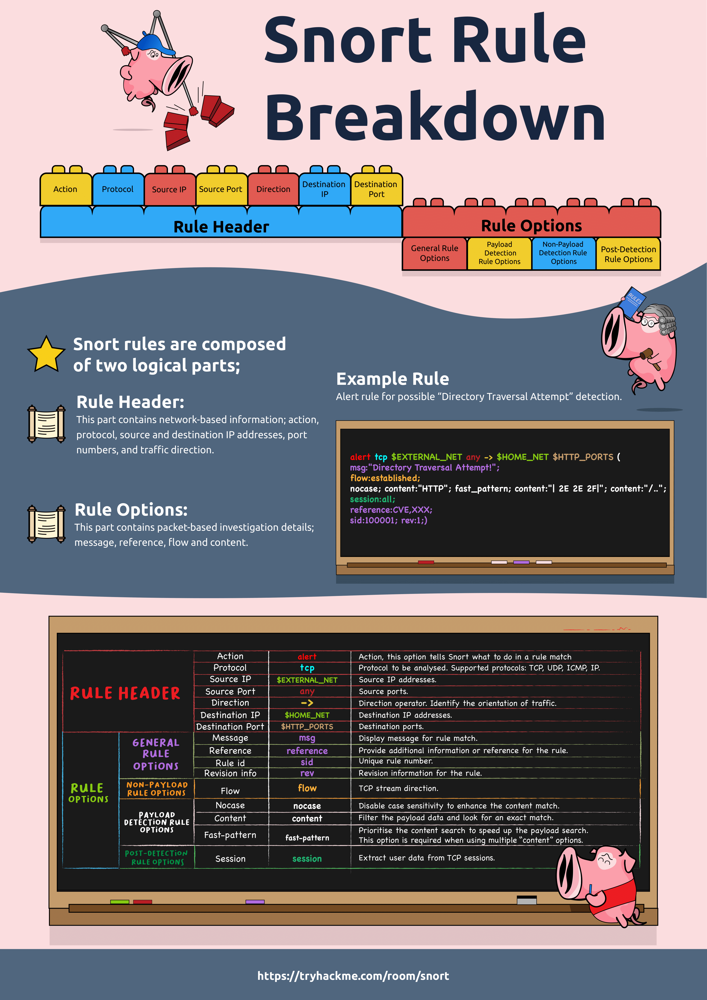
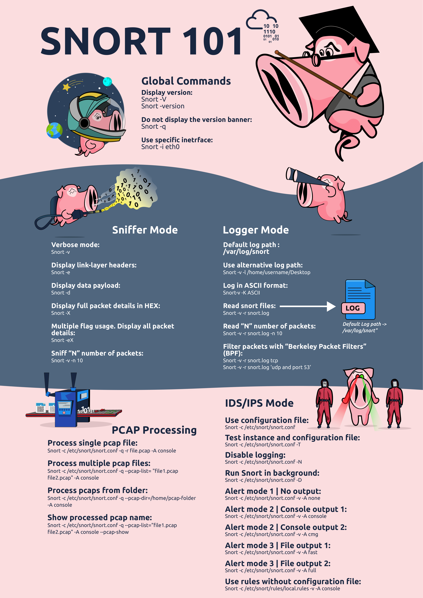

# Snort: An Overview and Historical Background

**Snort** is a widely used open-source solution for network security that can function as both a **Network Intrusion Detection System (NIDS)** and a **Network Intrusion Prevention System (NIPS)**. It is primarily **rule-based**, using signatures and policy rules to identify malicious or suspicious patterns in network traffic.

> **Official description:** “Snort is the foremost open-source Intrusion Prevention System (IPS) in the world. Snort IPS uses a series of rules that help define malicious network activity and uses those rules to identify matching packets and generate alerts for users.”


---

# Historical Background

- **1998 - Initial release.** Snort was created by **Martin Roesch** as a lightweight packet sniffer and intrusion detection tool. Its speed and simplicity quickly attracted users in both academia and industry.  
- **2001–2005 - Rapid growth.** A rich, community-driven **rule language** and ecosystem of shared signatures turned Snort into one of the first widely adopted open-source IDS platforms.  
- **2013 - Cisco acquisition of Sourcefire.** Roesch’s company **Sourcefire** (the commercial steward of Snort) was acquired by **Cisco**. Ongoing development and threat-intelligence curation are now led by **Cisco Talos** in collaboration with the open-source community.  
- **2019+ - Snort 3.** A major architectural update introduced a more **modular, performance-oriented** engine with improved rule parsing, scalability, and extensibility.

---

# How Snort Works (High Level)

1. **Packet capture:** Snort inspects network traffic in real time (libpcap or equivalent).  
2. **Preprocessors:** Optional modules normalize and prepare traffic (e.g., defragmentation, stream reassembly, protocol decoding).  
3. **Detection engine:** Packets/streams are matched against **rules** that describe threats using signatures, protocol/flow context, and payload conditions.  
4. **Actions & logging:** Depending on mode and rule actions, Snort can **alert**, **log**, or **drop/block** traffic (inline IPS).

---

# Key Capabilities

- **Signature-based detection:** Match known attack patterns (exploits, malware C2, scans).  
- **Protocol analysis & normalization:** Catch evasions and malformed traffic.  
- **Content and PCRE matching:** Deep payload inspection with flexible conditions.  
- **Multiple deployment modes:**  
  - **NIDS (passive):** Monitor and alert.  
  - **NIPS (inline):** Prevent by dropping packets.  
- **Integration-friendly output:** Unified2/JSON logs; works with SIEMs, dashboards, and SOC tooling.  
- **Rich rule ecosystem:** Community and Talos rulesets, with continuous updates.

---

# Common Use Cases

- **Intrusion detection & prevention** for enterprise and service-provider networks.  
- **Threat hunting & forensics** via detailed logs and packet captures.  
- **Compliance & monitoring** (e.g., detecting policy violations or suspicious lateral movement).  
- **Lab/training** environments to study network attacks and defenses.

---

# IDS vs IPS Overview (Before Snort)

Before diving into **Snort** and traffic analysis, it's essential to understand what an **Intrusion Detection System (IDS)** and an **Intrusion Prevention System (IPS)** are. Both can be configured within a network infrastructure, but they serve different purposes.

---

# Intrusion Detection System (IDS)

IDS is a **passive monitoring solution** designed to **detect malicious activities, abnormal behavior, or policy violations**. It **generates alerts** when suspicious events are detected, but it **does not block or stop traffic**.

### Types of IDS:
- **Network Intrusion Detection System (NIDS):**  
  Monitors traffic across an entire **subnet**. If a signature matches a known threat, an **alert** is triggered.
  
- **Host-based Intrusion Detection System (HIDS):**  
  Monitors traffic and events on a **single host or device**. Detects local suspicious activity and generates alerts.

---

# Intrusion Prevention System (IPS)

IPS is an **active protection solution** that not only detects but also **prevents malicious activities**. It can **stop, block, or terminate** the suspicious connection immediately upon detection.

# Types of IPS:
- **Network Intrusion Prevention System (NIPS):**  
  Monitors and protects the entire **subnet** by blocking malicious traffic.

- **Behavior-based IPS (Network Behavior Analysis - NBA):**  
  Detects anomalies by learning what is considered **“normal” traffic** (baselining) and identifying deviations.  
  > *Note: Training is crucial to reduce false positives. A poorly trained system may produce incorrect results or miss attacks.*

- **Wireless Intrusion Prevention System (WIPS):**  
  Focused on securing **wireless networks** by detecting and blocking wireless-based attacks.

- **Host-based Intrusion Prevention System (HIPS):**  
  Protects a **single endpoint**, actively terminating malicious connections.  
  > *HIPS works like HIDS but adds prevention capabilities instead of only generating alerts.*

---

# Detection & Prevention Techniques

IDS and IPS solutions typically use **three main approaches**:

| Technique           | Description                                                               |
| ------------------- | ------------------------------------------------------------------------- |
| **Signature-Based** | Matches known attack patterns. Effective for known threats.               |
| **Behavior-Based**  | Detects anomalies compared to normal traffic. Useful for unknown threats. |
| **Policy-Based**    | Compares activities against predefined policies to detect violations.     |

---

# Summary (IDS vs IPS)

- **IDS** → Detects threats, but **requires user action** to block them.  
- **IPS** → Detects **and automatically blocks** threats in real time.  

---

# Snort: Overview

**Snort** is an **open-source, rule-based Network Intrusion Detection and Prevention System (NIDS/NIPS)** developed by **Martin Roesch** in 1998. It is maintained by the **open-source community** and the **Cisco Talos team**.

> *Official Description:*  
> “Snort can be deployed inline to stop these packets, as well. Snort has three primary uses:  
> - As a packet sniffer like tcpdump  
> - As a packet logger (for network debugging)  
> - As a full-blown Network Intrusion Prevention System.”  

---

# Key Capabilities of Snort

- **Live traffic analysis**
- **Attack and probe detection**
- **Packet logging**
- **Protocol analysis**
- **Real-time alerting**
- **Support for modules & plugins**
- **Pre-processors**
- **Cross-platform (Linux & Windows)**

---

# Snort Operating Modes

1. **Sniffer Mode:**  
   Reads and displays IP packets in real-time on the console.

2. **Packet Logger Mode:**  
   Logs all inbound and outbound IP packets for analysis.

3. **NIDS/NIPS Mode:**  
   Detects and blocks packets classified as malicious based on user-defined rules.

---

# Snort: First Interaction and Modes

This guide explains how to verify Snort installation, test configurations, and run Snort in different modes: **Sniffer**, **Logger**, **IDS/IPS**, and **PCAP**. Everything is inside a single code block for easy copy-paste.

---

# 0) Verify Installation & Config Test

# Show Snort version
```python
snort -V
```

# Test the configuration file
```python
sudo snort -T -c /etc/snort/snort.conf
```

# Quiet mode (hide banner)
```python
snort -q
```

# Core Parameters
| Parameter | Description                        |
| --------- | --------------------------------- |
| -V        | Show Snort version               |
| -c        | Use configuration file           |
| -T        | Test configuration and exit      |
| -q        | Quiet mode: hide banner & info   |

---

# 1) Sniffer Mode (like tcpdump)

Snort can display packet info on the fly.

### Parameters
| Parameter | Description                          |
| --------- | ----------------------------------- |
| -v        | Verbose: TCP/IP headers            |
| -d        | Show packet data (payload)         |
| -e        | Show link-layer headers            |
| -X        | Full packet in HEX + ASCII         |
| -i <if>   | Interface to listen on (e.g., eth0)|

# Examples
# Verbose on eth0
```python
sudo snort -v -i eth0
```

# Verbose + payload
```python
sudo snort -vd
```

# Verbose + payload + link-layer
```python
sudo snort -vde
```

# Full packet dump
```python
sudo snort -X
```

---

# 2) Logger Mode (save traffic)

Snort can log packets for later analysis.

# Parameters
| Parameter | Description                                        |
| --------- | -------------------------------------------------- |
| -l DIR    | Log directory (default: /var/log/snort)           |
| -K ASCII  | Log packets in ASCII format                       |
| -r FILE   | Read binary log file                              |
| -n NUM    | Limit number of packets processed                 |

# Examples
# Log in current directory
```python
sudo snort -dev -l .
```

# Log in ASCII format
```python
sudo snort -dev -K ASCII -l .
```

# Read a log file
```python
sudo snort -r snort.log -X
```

# Read log with BPF filter
```python
sudo snort -r snort.log icmp
sudo snort -r snort.log tcp
sudo snort -r snort.log 'udp and port 53'
```

# Read only 10 packets
```python
sudo snort -dvr snort.log -n 10
```

# Ownership Note
Logs created as root → need sudo or change ownership:
```python
sudo chown $USER:$USER snort.log
```

---

# 3) IDS/IPS Mode (rule-based detection)

Run Snort with rules from your config.

# Parameters
| Parameter | Description                                    |
| --------- | --------------------------------------------- |
| -c FILE   | Config file (required)                       |
| -T        | Test configuration                            |
| -N        | Disable logging                               |
| -D        | Daemon mode                                   |
| -A MODE   | Alert mode: console, cmg, fast, full, none   |

# Alert Modes
| Mode    | Description                                     |
| ------- | ---------------------------------------------- |
| console | Fast-style alerts in console                   |
| cmg     | Header + payload (hex/text) in console         |
| fast    | Minimal alert in log only                      |
| full    | Detailed alert in log only                     |
| none    | Disable alerts (still logs traffic)            |

# Examples
# Test config
```python
sudo snort -c /etc/snort/snort.conf -T
```

# Run with console alerts
```python
sudo snort -c /etc/snort/snort.conf -A console
```

# Run with cmg alerts
```python
sudo snort -c /etc/snort/snort.conf -A cmg
```

# Disable logging
```python
sudo snort -c /etc/snort/snort.conf -N
```

# Background mode
```python 
sudo snort -c /etc/snort/snort.conf -D
```

---

# 4) PCAP Mode (offline analysis)

Analyze pcap files for alerts and stats.

# Parameters
| Parameter             | Description                                     |
| --------------------- | ----------------------------------------------- |
| -r FILE               | Read a single pcap                             |
| --pcap-list="a b c"   | Process multiple pcaps                         |
| --pcap-show           | Show pcap name while processing                |

# Examples
# Basic read
```python
python snort -r sample.pcap
```

# Read with config and alerts
```python
sudo snort -c /etc/snort/snort.conf -q -r icmp.pcap -A console -n 10
```

# Multiple pcaps
```python 
sudo snort -c /etc/snort/snort.conf --pcap-list="icmp.pcap http.pcap" -A console
```

# Show pcap names
```python
sudo snort -c /etc/snort/snort.conf --pcap-list="icmp.pcap http.pcap" -A console --pcap-show
```

---

# 5) Rule Basics

```python
Snort rules = **action + protocol + src/dst IP + ports + direction + options**.
```

# Common Actions
| Action  | Description                                       |
| ------- | ------------------------------------------------- |
| alert   | Generate alert and log packet                    |
| log     | Log packet only                                  |
| drop    | Drop packet + log (IPS mode required)            |
| reject  | Drop + log + send TCP RST/ICMP unreachable       |

# Direction
| Symbol | Meaning                      |
| ------ | --------------------------- |
| ->     | Source → Destination        |
| <>     | Bidirectional               |

# Examples
# Simple ICMP alert
```python
alert icmp any any <> any any (msg:"ICMP Packet Found"; sid:100001; rev:1;)
```

# IP range
```python
alert icmp 192.168.1.0/24 any <> any any (msg:"ICMP from subnet"; sid:100002; rev:1;)
```

# Port filter
```python
alert tcp any any -> any 21 (msg:"FTP traffic"; sid:100003; rev:1;)
```

# Negation
```python
alert tcp any any -> any !21 (msg:"Non-FTP traffic"; sid:100004; rev:1;)
```


**TIP:** Add your rules to `/etc/snort/rules/local.rules`.

# Examples rules that i create for ctf room

Write a rule to detect all TCP packets **from or to** port 80.
```python
alert tcp any 80 <> any any (msg:”TCP port 80 found”; sid:100001; rev:1;)
```
 
 Write a **single** rule to detect "**all TCP port 21**"  traffic in the given pcap.
```python
alert tcp any 21 <> any any (msg:"src:FTP found"; sid:100001; rev:1;)
```

What is the FTP service name?
```python
sudo snort -r snort.log.1671731339 -X -n 10 // read 10 packets 
```


Write a rule to detect failed FTP login attempts in the given pcap.
```python
alert tcp any 21 <> any any (msg:"Detectected Failed FTP Login"; content:"530 User"; sid:100003; rev:1;)
```
[List of ftp responding codes here ->](https://en.wikipedia.org/wiki/List_of_FTP_server_return_codes)


Write a rule to detect successful FTP logins in the given pcap.
```python
alert tcp any 21 <> any any (msg:"Detected Successful FTP Login"; content:"230 User"; sid:100004;
```

Write a rule to detect FTP login attempts with a valid username but no password entered yet.
```python
alert tcp any 21 <> any any (msg:"FTP Failed Login-Bad or No Password"; content:"331 Password"; sid:100005; rev:1;)
```

Write a rule to detect FTP login attempts with the "Administrator" username but no password entered yet.
```python
alert tcp any 21 <> any any (msg:"FTP Failed Admin Login-Bad or No Password"; content:"331 Password"; fast_pattern; content:"Administrator"; sid:100006; rev:1;)
```

Write a rule to detect the PNG file in the given pcap.
```python
alert tcp any any <> any any (msg:"PNG file Detected"; content:"|89 50 4A 47 0D 0A 1A 0A|"; sid:100002; rev:1;)
```
*the || is to show a number in hex format.. every file type has a hex signature in the start of it!*

Write a rule to detect the GIF file in the given pcap.
```python
alert tcp any any <> any any (msg:"GIF File Detected"; content:"|47 49 46 38 39|"; sid:100003; rev:1;)
```


*lets create IDS Rules for torrent metafiles in the traffic!*

Write a rule to detect the torrent metafile in the given pcap.
```python
alert tcp any any <> any any (msg: "Torrent"; content:"torrent"; sid: 10000001; rev:1;)
```

Write a rule to detect packet payloads **between 770 and 855 bytes**.
```python
alert tcp any any -> any any (msg:"Tcp connections"; dsize:770<>855;  sid: 100001; rev:1;)
```


---
# wrong syntax rules

 -  1 syntax error
```python
alert tcp any 3372 -> any any(msg: "Troubleshooting 1"; sid:1000001; rev:1;)
```
 [Syntax] Missing required space before options block: should be "... any any (msg: ...)"

 - 1 syntax error 
```python
alert icmp any -> any any (msg: "Troubleshooting 2"; sid:1000001; rev:1;)
```
 [Syntax] ICMP rules do not use ports; remove the trailing destination port "any".

 - 1 syntax error
```python
alert icmp any any -> any any (msg: "ICMP Packet Found"; sid:1000001; rev:1;)
alert tcp any any -> any 80,443 (msg: "HTTPX Packet Found"; sid:1000001; rev:1;)
```
 [Syntax] ICMP rule incorrectly includes ports ("any any"); ICMP has no ports.

 -  2 syntax errors 
```python
alert icmp any any -> any any (msg: "ICMP Packet Found"; sid:1000001; rev:1;)
alert tcp any 80,443 -> any any (msg: "HTTPX Packet Found": sid:1000001; rev:1;)
```
 [Syntax 1] ICMP rule includes ports; ICMP has no ports.
 [Syntax 2] Extra colon after msg string: use ... msg:"HTTPX Packet Found"; sid:...

- 2 syntax errors 
```python
alert icmp any any <> any any (msg: "ICMP Packet Found"; sid:1000001; rev:1;)
alert icmp any any <- any any (msg: "Inbound ICMP Packet Found"; sid;1000002; rev:1;)
```
alert tcp any any -> any 80,443 (msg: "HTTPX Packet Found": sid:1000003; rev:1;)
 [Syntax 1] Invalid direction operator "<-"; valid are "->" or "<>".
 [Syntax 2] Wrong separator in option: "sid;1000002" must be "sid:1000002".

 - logic error (case sensitive; add `nocase;`) 
```python
alert tcp any any <> any 80  (msg: "GET Request Found"; content:"|67 65 74|"; sid: 100001; rev:1;)
```
[Logic] Content bytes 67 65 74 = "get" (lowercase). HTTP methods are typically uppercase. Add "nocase;" (or match ASCII "GET ") to avoid missing true positives.


 -  logic error (no msg; rule runs but not useful) 
```python
alert tcp any any <> any 80  (content:"|2E 68 74 6D 6C|"; sid: 100001; rev:1;)
```
 [Logic] Missing "msg" option; alerts will have empty/unnamed message, reducing usefulness.


# Manual PDF (Snort from tryhackme)







