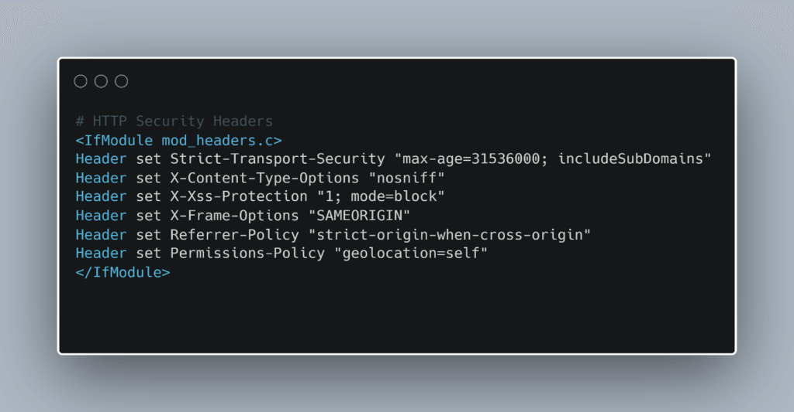

# HTTP Security Headers

HTTP Security Headers are fundamental components of modern web application security. They act as additional layers of defense by providing instructions to the browser on how to process and handle content, enforce encryption requirements, and limit the information exchanged with external sites. Unlike traditional server-side configurations, which protect resources at the backend, security headers enforce client-side rules that strengthen resilience against attacks. When properly implemented, they significantly reduce exposure to threats such as Cross-Site Scripting (XSS), clickjacking, MIME-type misinterpretation, and sensitive data leakage [1], [2].

These headers are evaluated as part of security assessments, with tools such as securityheaders.io frequently used to determine the configuration status of web applications. Understanding their purpose and correct configuration is essential for any organization that wishes to implement a robust defense-in-depth strategy [2].



---
# 1. Content-Security-Policy (CSP)

The **Content-Security-Policy (CSP)** header is designed to mitigate client-side attacks, most notably Cross-Site Scripting (XSS), which occurs when an attacker successfully injects malicious scripts into a trusted website. Such attacks can lead to session hijacking, credential theft, or unauthorized actions executed on behalf of users. CSP counters this by providing web administrators with a mechanism to define a strict whitelist of trusted content sources [3].

For instance:  
```\`Content-Security-Policy: default-src 'self'; script-src 'self' https://cdn.example.com; style-src 'self'```

In this configuration:

- **default-src 'self'** specifies that the browser may only load resources from the same origin as the website.
- **script-src** defines that JavaScript may be loaded either from the same domain or from a trusted external content delivery network (CDN).    
- **style-src** restricts the loading of CSS to the same domain.


By restricting the origin of executable scripts and styles, CSP prevents malicious content hosted on untrusted domains from being executed in the client’s browser. Furthermore, CSP can be configured with additional directives, such as `img-src` (for images), `frame-ancestors` (to prevent clickjacking via iframes), and `report-uri` or `report-to` (for logging policy violations). This makes CSP one of the most comprehensive browser-enforced protections available today [4].

---
# 2. Strict-Transport-Security (HSTS)

The **HTTP Strict-Transport-Security (HSTS)** header enforces the use of encrypted HTTPS connections by instructing the browser to reject all future attempts to connect via the insecure HTTP protocol [5]. This prevents downgrade attacks, where an attacker might attempt to force the browser into communicating over HTTP, and mitigates risks such as cookie hijacking during transmission.

Example configuration:  
Strict-Transport-Security: max-age=63072000; includeSubDomains; preload

- **max-age=63072000** indicates that the browser must enforce HTTPS-only connections for two years.
- **includeSubDomains** extends this protection to all subdomains, which is crucial since an attacker might otherwise target a weaker subdomain.
- **preload** allows the site to be included in browser preload lists, which means the browser will only ever attempt HTTPS connections even before the first visit.

HSTS is a strong defense against protocol downgrade attacks and ensures persistent secure transport. Without HSTS, users could be tricked into insecure connections on hostile networks (e.g., public Wi-Fi). By enabling preload, organizations achieve a proactive enforcement model that virtually eliminates the possibility of accidental or malicious HTTP traffic [6].

---
# 3. X-Content-Type-Options

The **X-Content-Type-Options** header addresses a browser feature called MIME-type sniffing. When this feature is enabled, browsers may try to infer the type of a file based on its content rather than strictly respecting the declared `Content-Type` header. While this behavior may increase compatibility, it also introduces security risks. Attackers can disguise malicious files, such as JavaScript code, under misleading content types to bypass filters [7].

Example configuration:  
X-Content-Type-Options: nosniff

- **nosniff** disables MIME-type sniffing, forcing the browser to strictly enforce the MIME type declared by the server.

This simple directive ensures that files advertised as images, stylesheets, or other benign formats cannot be interpreted as executable code. In practice, this prevents attackers from uploading files with deceptive extensions that could otherwise execute in the browser. Although the header is relatively straightforward, it remains an essential safeguard against content-type confusion attacks [7].

---
# 4. Referrer-Policy

The **Referrer-Policy** header determines how much referrer information (the URL of the page that initiated a request) is shared when users navigate between websites. Without explicit control, sensitive details embedded in URLs, such as authentication tokens or session identifiers, could inadvertently be exposed to third parties [8].

Different configurations provide varying levels of privacy and utility:

- **no-referrer**: The browser sends no referrer information at all. This offers maximum privacy but may interfere with analytics and referral tracking.
- **same-origin**: Referrer information is only sent if the request remains within the same origin. This prevents leakage to external sites but preserves useful internal navigation data.
- **strict-origin**: The browser sends only the scheme, host, and port of the origin, but only if the security level remains the same (e.g., HTTPS to HTTPS). This avoids sending full paths while maintaining some referral context.
- **strict-origin-when-cross-origin**: For same-origin requests, the full URL is sent, but for cross-origin requests, only minimal information is shared. This represents a balanced option between functionality and security.

By adopting a restrictive Referrer-Policy, organizations ensure that private information embedded in query strings or internal URLs does not leak to external parties, thus enhancing user privacy and protecting internal architecture [9].

---

# Conclusion

Security headers represent a critical element of modern web security architecture. Each of the headers, CSP, HSTS, X-Content-Type-Options, and Referrer-Policy addresses a distinct attack vector. Collectively, they enforce strict content handling rules, guarantee encrypted transport, prevent content-type misinterpretation, and limit sensitive information exposure. While they cannot replace secure coding practices or rigorous server-side protections, they provide an indispensable browser-level enforcement mechanism that strengthens overall resilience against common attack scenarios [2], [5].

Organizations that consistently deploy and audit these headers demonstrate a commitment to best practices in cybersecurity and significantly reduce their vulnerability to both opportunistic and targeted web-based attacks.


---

[1] OWASP Foundation, _OWASP Secure Headers Project_, OWASP, 2021.  
[2] Ivan Ristić, _Bulletproof SSL and TLS_, Feisty Duck, 2014.  
[3] M. West, _Content Security Policy Level 3_, W3C Candidate Recommendation, 2018.  
[4] D. Akhawe, A. Barth, “Towards a Formal Foundation of Web Security,” IEEE CSF, 2012.  
[5] J. Hodges, C. Jackson, A. Barth, _HTTP Strict Transport Security (HSTS)_, RFC 6797, IETF, 2012.  
[6] M. Georgiev et al., “The Most Dangerous Code in the World: Validating SSL Certificates in Non-Browser Software,” ACM CCS, 2012.  
[7] Microsoft, _MIME-Handling: X-Content-Type-Options Header_, Microsoft Security Documentation, 2010.  
[8] W3C, _Referrer Policy Recommendation_, W3C, 2017.  
[9] A. Barth, C. Jackson, J. C. Mitchell, “Robust Defenses for Cross-Site Request Forgery,” ACM CCS, 2008.