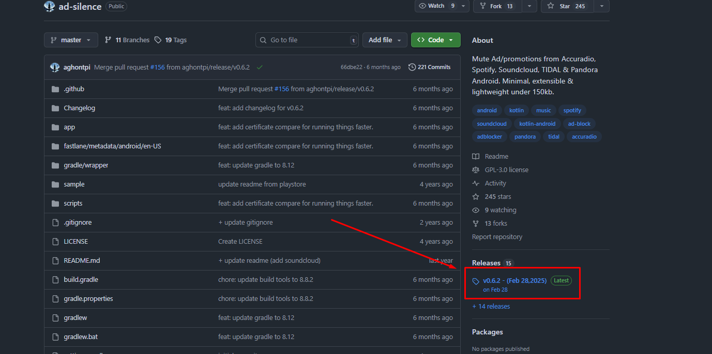
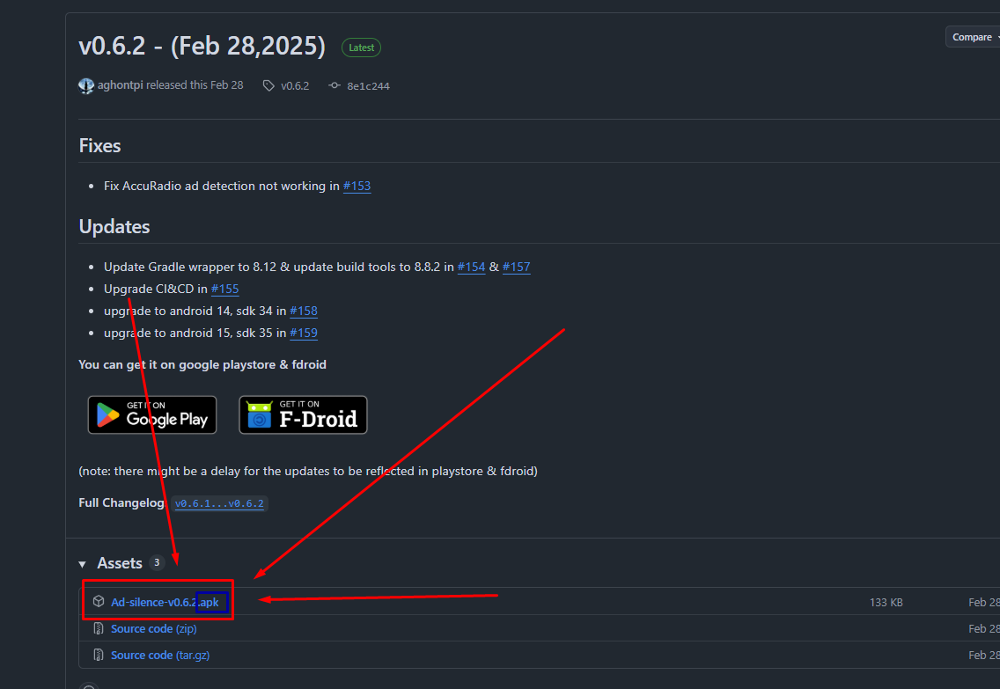

# Tools for Spotify
I’ve tested several great tools that improve the Spotify experience. Some people asked, so I’m sharing them here.

Bruh if you haven't used github again then download the latest release from here:

---

## 🖥 Ad-Free Spotify (Desktop)

If you want to remove ads on your PC (Windows), check out these tools:

| Tool             | Description                                           | Link                                                          |
| ---------------- | ----------------------------------------------------- | ------------------------------------------------------------- |
| **SpotX**        | The most popular tool for ad-free Spotify on Windows. | [SpotX GitHub](https://github.com/SpotX-Official/SpotX)       |
| **BlockTheSpot** | Another way to block ads on desktop.                  | [BlockTheSpot GitHub](https://github.com/mrpond/BlockTheSpot) |

---

# Ad-Free Spotify (Mobile)

I don’t personally use ad-free Spotify on mobile, but here are some sources you might find useful:

| Tool / Source | Description | Link |
|---------------|-------------|------|
| **ReVanced** | Popular choice for modded apps. | [revanced.app](https://revanced.app/download) |
| **Mobilism Forum** | Community for modded APKs. | [Mobilism Search](https://forum.mobilism.org/search.php?st=0&sk=t&sd=d&sr=topics&keywords=Spotify&sf=titleonly) |
| **XManager** | App for managing Spotify mods. | [xmanagerapp.com](https://www.xmanagerapp.com) |
| **Ad-Silence** | Open-source tool to mute ads. | [GitHub](https://github.com/aghontpi/ad-silence) |
| **Mutify** | Found on Google Play (not sure if legit yet). | [Google Play](https://play.google.com/store/apps/details?id=live.teekamsuthar.mutify) |

---

#  Other Useful Tools

| Tool | Description | Link |
|------|-------------|------|
| **Spotivity** | See what music your friends are listening to. | [spotivity.me](https://spotivity.me) |
