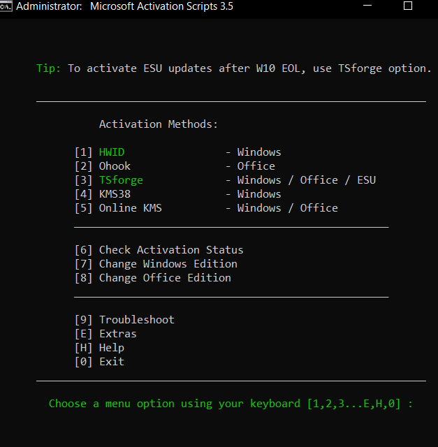

# How to Activate Windows for Free (My Personal Method)
----------------------------------------------------

This is my current method for activating Windows for free.
Please note:
- This is my personal approach.
- There may be easier or more trustworthy methods.
- I'm sharing this mainly for friends who ask me.

---
# Step 1 – Visit the Activation Website

Open your browser and go to: [massgrave.dev](https://massgrave.dev/#Method-1---PowerShell)

This site:
- Is well-known in the tech community.
- Automates the activation process.
- Is fully open-source (code is on GitHub).
- Works for both Windows and Microsoft Office.

---
# Step 2 – Open PowerShell as Administrator

1. Press the Windows key.
2. Type: powershell
3. Right-click "Windows PowerShell".
4. Select "Run as Administrator".

---
# Step 3 – Run the Activation Command

PS C:\Windows\system32> irm https://get.activated.win | iex

Press Enter.

---
# Step 4 – Choose an Activation Option

When the menu appears:
- If you are unsure, press 1 (recommended method).
- Wait until the process completes.

---
# Step 5 – Optional: Activate Microsoft Office

The same menu allows you to activate Office or install it first.

Done.
------
Your Windows (and optionally Office) should now be activated.
